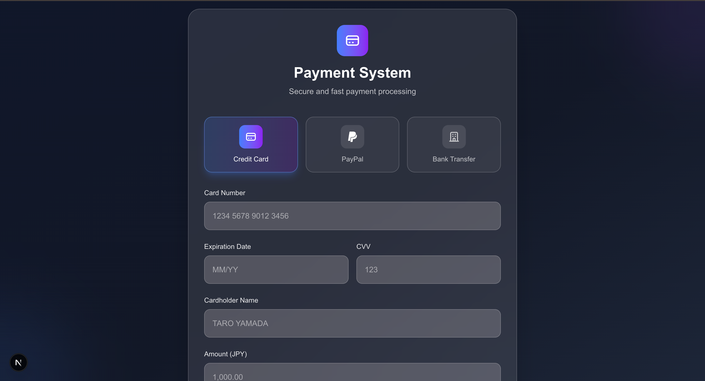

# Payment Gateway System

A modern payment processing web application built with **Spring Boot** (Backend) and **Next.js** (Frontend), featuring a beautiful UI with Tailwind CSS.
This App is practice project for using Spring Boot as Restfull API.

## 🚀 Features

- **Multiple Payment Methods**: Credit Card, PayPal, and Bank Transfer
- **Modern UI/UX**: Beautiful, responsive design with dark theme
- **Real-time Processing**: Live payment processing with loading states
- **Secure API**: RESTful API with CORS support
- **Type Safety**: Full TypeScript support
- **Responsive Design**: Works on desktop and mobile devices

## 🏗️ Architecture

```
├── backend/                 # Spring Boot API Server
│   ├── src/main/java/
│   │   └── com/example/paymentSystem/
│   │       ├── controller/  # REST API Controllers
│   │       ├── model/       # Payment Models
│   │       └── config/      # CORS Configuration
│   └── pom.xml
├── frontend/                # Next.js Frontend
│   ├── src/
│   │   ├── app/            # Next.js App Router
│   │   └── components/     # React Components
│   └── package.json
└── README.md
```

## 🛠️ Tech Stack

### Backend
- **Java 24** with Spring Boot 3.2.0
- **Maven** for dependency management
- **Spring Web** for REST API
- **Thymeleaf** for server-side templates

### Frontend
- **Next.js 14** with App Router
- **TypeScript** for type safety
- **Tailwind CSS** for styling
- **React Hooks** for state management

## 📋 Prerequisites

- **Java 24** (JDK)
- **Node.js 18+** and npm
- **Maven** (optional, can use Maven wrapper)

## 🚀 Quick Start

### 1. Clone the Repository

```bash
git clone https://github.com/meso1007/JAVA-Payment-Gateway-System.git
cd JAVA-Payment-Gateway-System
```

### 2. Backend Setup

```bash
# Navigate to backend directory
cd backend

# Set JAVA_HOME (if not already set)
export JAVA_HOME=/Library/Java/JavaVirtualMachines/jdk-24.0.1.jdk/Contents/Home
export PATH=$JAVA_HOME/bin:$PATH

# Start Spring Boot application
mvn spring-boot:run
```

The backend will start on `http://localhost:8080`

### 3. Frontend Setup

```bash
# Open a new terminal and navigate to frontend directory
cd frontend

# Install dependencies
npm install

# Start development server
npm run dev
```

The frontend will start on `http://localhost:3000`

### 4. Access the Application

Open your browser and navigate to `http://localhost:3000`

## 🎯 Usage

1. **Select Payment Method**: Choose between Credit Card, PayPal, or Bank Transfer
2. **Fill Payment Details**: Enter the required information for your chosen payment method
3. **Enter Amount**: Specify the payment amount in JPY
4. **Submit Payment**: Click "Pay Now" to process the payment
5. **View Results**: See the payment processing result

## 🔧 API Endpoints

### Payment Processing
- `POST /api/payments/creditcard` - Process credit card payments
- `POST /api/payments/paypal` - Process PayPal payments  
- `POST /api/payments/banktransfer` - Process bank transfer payments

### Web Interface
- `GET /` - Main payment form (Thymeleaf template)

## 🎨 UI Screenshots

### Main Payment Form


## 🔒 Security Features

- **CORS Configuration**: Properly configured for cross-origin requests
- **Input Validation**: Client and server-side validation
- **Secure Headers**: Spring Security headers
- **HTTPS Ready**: Configured for production HTTPS deployment

## 🚀 Deployment

### Backend Deployment
```bash
cd backend
mvn clean package
java -jar target/payment-system-1.0.0.jar
```

### Frontend Deployment
```bash
cd frontend
npm run build
npm start
```

## 🤝 Contributing

1. Fork the repository
2. Create a feature branch (`git checkout -b feature/amazing-feature`)
3. Commit your changes (`git commit -m 'Add some amazing feature'`)
4. Push to the branch (`git push origin feature/amazing-feature`)
5. Open a Pull Request

## 📝 License

This project is licensed under the MIT License - see the [LICENSE](LICENSE) file for details.

## 🆘 Support

If you encounter any issues or have questions:

1. Check the [Issues](https://github.com/meso1007/JAVA-Payment-Gateway-System/issues) page
2. Create a new issue with detailed information
3. Contact the maintainers

## 🔄 Development Workflow

- **main**: Production-ready code
- **develop**: Development branch for new features
- **feature/***: Individual feature branches

## 📊 Project Status

- ✅ Backend API (Spring Boot)
- ✅ Frontend UI (Next.js)
- ✅ Payment Processing
- ✅ CORS Configuration
- ✅ Responsive Design
- 🔄 Unit Tests (In Progress)
- 🔄 E2E Tests (Planned)
- 🔄 Production Deployment (Planned)

---

**Built with SHOYA HORIUCHI using Spring Boot and Next.js**
